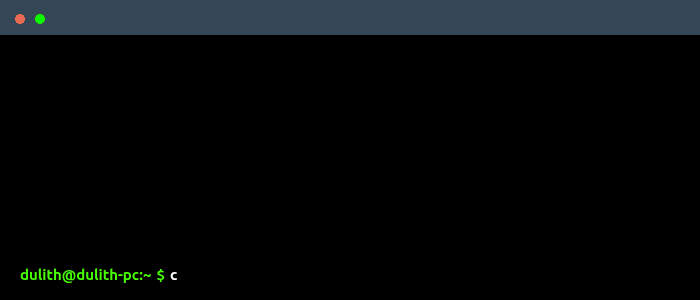

# Terminal Portfolio

A serverless command-line interface resume deployed on the edge. This project detects the client environment and routes traffic accordingly. It serves ASCII layouts to terminals and redirects standard web browsers to a graphical user interface.

## Viewing the Portfolio Live

You can interact with the live deployed worker using your system native terminal. Copy and paste the appropriate command below based on your environment.

| Operating System | Native Terminal Command |
| :--- | :--- |
| **Linux & Mac** | `curl https://whoami.dulithdivisekara.workers.dev` |
| **Windows (PowerShell)** | `Invoke-RestMethod https://whoami.dulithdivisekara.workers.dev` |
| **Windows (CMD)** | `curl.exe https://whoami.dulithdivisekara.workers.dev` |

*Note: Accessing the URL via a standard web browser will automatically redirect you to the visual portfolio at dulithdivisekara.pages.dev.*

<b>Click to expand: Local Setup and Deployment</b>

To host and modify your own version of this project, verify that Node.js is installed on your system.

1. Clone this repository and navigate into the root directory.
2. Start the local Cloudflare development server by executing `npx wrangler dev`.
3. Open a secondary terminal window and verify the output by querying `http://localhost:8787`.
4. Deploy the modified worker to your personal Cloudflare edge network by executing `npx wrangler deploy`.

